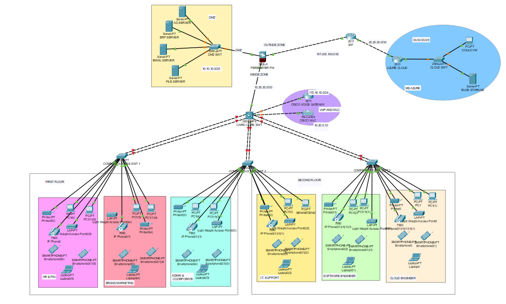
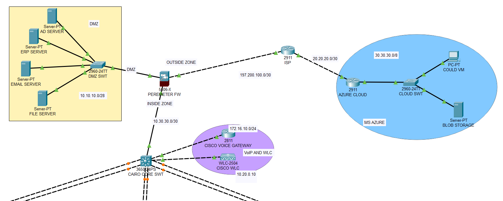
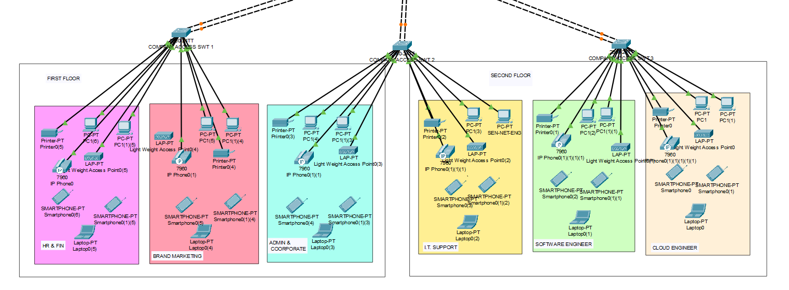

# Cairo Telco: A Secure Enterprise Network Simulation

Welcome to my Cairo Telco network project!  This is a comprehensive simulation I built in Cisco Packet Tracer to design and implement a secure, scalable, and robust network for a growing company[cite: 25, 27, 32].

## The Challenge

 The scenario involves a fictional company, Cairo Telco, a fast-growing telecommunication company in Cairo, Egypt[cite: 5, 6].  The company occupies the fourth and fifth floors of a building, hosting six different departments: HR and Finance, Product Brand and Marketing, Admin and Corporate, IT Network & Support, Software Engineering, and Cloud Engineering[cite: 7, 8, 9, 10].

They needed a complete network infrastructure from the ground up.  The main requirements were high performance, redundancy, scalability, and availability[cite: 29].  A critical part of the project was ensuring secure connectivity to their Microsoft Azure cloud resources, which are core to their business functions[cite: 20, 21, 22].

 My goal was to design and configure a network that not only met these technical demands but was also well-organized and easy to manage, following best practices[cite: 26].

## My Approach & Key Features

 I decided to build the network using a **hierarchical model** to ensure it was redundant and scalable[cite: 33]. This separates the network into core, distribution, and access layers, which makes it much easier to troubleshoot and expand.

Here are some of the key decisions and features I implemented:

* **Security First:** Security was the top priority.
    *  I placed a **Cisco ASA Firewall** at the edge to manage traffic between the internal network, the internet, and a dedicated DMZ for the company's servers[cite: 24, 52].  The DMZ hosts the internally hosted ERP system, Email server, and File server[cite: 16, 17].
    *  On the switches, I enabled **STP PortFast** on access ports for faster device connectivity and **BPDU Guard** to prevent unauthorized switches from being added to the network[cite: 39, 56].
    *  I wrote a standard **ACL to lock down SSH access**, so only the ICT department can manage devices remotely[cite: 51].

* **Building for Reliability and Speed:**
    *  I segmented the network using **VLANs** to keep traffic for LAN (VLAN 50), WLAN (VLAN 60), and Voice (VLAN 101) separate[cite: 23, 37, 55]. This improves both security and performance.
    *  To boost performance and add redundancy between my switches, I configured **LACP EtherChannel**, which bundles multiple links into one logical connection[cite: 38, 56].
    *  I used **OSPF** as the dynamic routing protocol to ensure that all parts of the network could find the best path to communicate with each other automatically[cite: 50, 58].

* **Unified Communications & Services:**
    *  The design includes a full **VoIP system**, with a Cisco Voice Gateway providing telephony services to IP phones in each department[cite: 17, 18, 36, 49].
    *  I set up a **centralized wireless network** using a Cisco Wireless LAN Controller (WLC) to manage all the access points, providing seamless Wi-Fi across both floors[cite: 18, 19, 35].
    *  A central Windows Server 2022 handles **Active Directory, DNS, and DHCP**, so devices can get an IP address automatically [cite: 14, 15, 16, 45] , while servers in the DMZ have **static IPs**[cite: 47, 57].

## Network Topology

### IP Addressing Plan

 This was the IP address scheme I was given for the project[cite: 30]:
*  **WLAN:** `10.20.0.0/16` [cite: 30]
*  **LAN:** `192.168.10.0/24` [cite: 30]
*  **Voice:** `172.16.10.0/24` [cite: 30]
*  **DMZ:** `10.10.10.0/28` [cite: 30]
*  **Public:** `197.200.100.0` [cite: 30]

### Core Technologies Used

*  **Simulation Tool:** Cisco Packet Tracer [cite: 32]
*  **Key Hardware (Simulated):** Cisco ASA 5525-X Firewall [cite: 12] , Catalyst 3850 & 2960 Switches [cite: 12, 13] , Cisco 2811 Voice Gateway [cite: 46] , Cisco WLC, and Lightweight APs[cite: 14].
*  **Protocols & Concepts:** OSPF [cite: 50] , LACP EtherChannel [cite: 38] , STP (PortFast, BPDU Guard) [cite: 39] , VLANs [cite: 37] , Inter-VLAN Routing [cite: 42] , DHCP [cite: 45] , VoIP [cite: 36] , Standard ACLs [cite: 51] , Firewall Security Zones[cite: 52].
